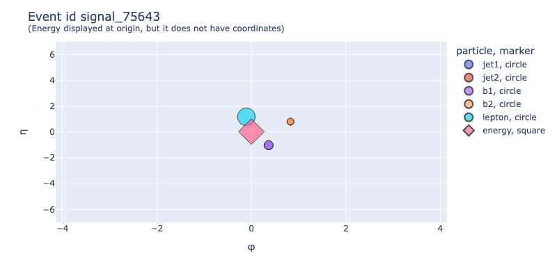
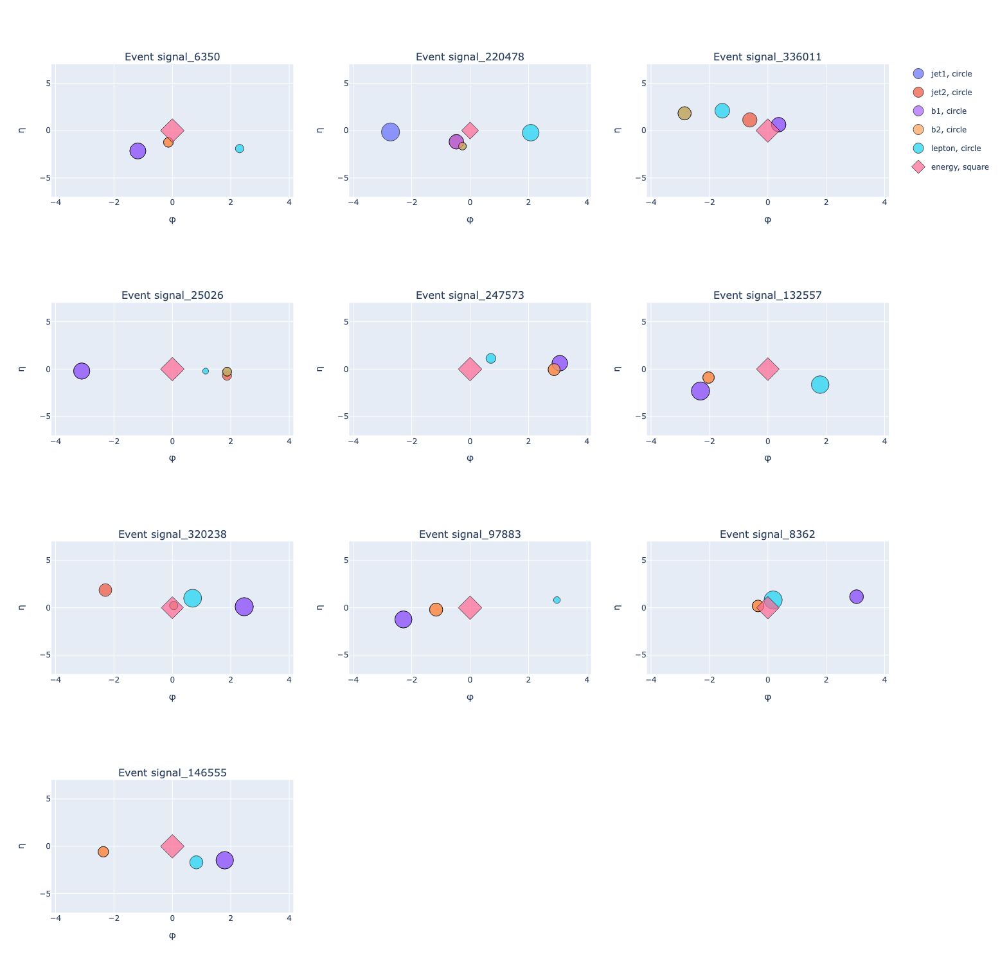

# Sparticles
Manipulate collision events via graphs and graph neural networks.

### TL;DR
The EventsDataset, a Pytorch Geometric Dataset, allows you to download a dataset of graphs representing collisions. 

```python
from dataset import EventsDataset

graphs = EventsDataset(
            root='/Users/alessiodevoto/Desktop/test_dataset3',
            delete_raw_archive=False,
            event_subsets={'signal': 100, 'singletop': 100, 'ttbar': 100},
            url='<secret_url>')

graphs
```

> EventsDataset(300)


    
Each event is a graph with 6/7 nodes. Each node is built from the raw file as follows:

| Particle          | Feature 1 | Feature 2 | Feature 3   | Feature 4     | Feature 5 | Feature 6    |
|-------------------|-----------|-----------|-------------|---------------|-----------|--------------|
| jet1              |  'pTj1'   | 'etaj1'   |   'phij1'   | 'j1_quantile' |    nan    |     nan      |
| jet2              |  'pTj2'   | 'etaj2'   |   'phij2'   | 'j2_quantile' |    nan    |     nan      |
| jet3 (optional)   |  'pTj3'   | 'etaj3'   |   'phij3'   | 'j3_quantile' |    nan    |     nan      |
| b1                |  'pTb1'   | 'etab1'   |   'phib1'   | 'b1_quantile' |   'b1m'   |     nan      |
| b2                |  'pTb2'   | 'etab2'   |   'phib2'   | 'b2_quantile' |   'b2m'   |     nan      |
| lepton            |  'pTl1'   | 'etal1'   |   'phil1'   |      nan      |    nan    |     nan      |
| energy            | 'ETMiss'  |   nan     | 'ETMissPhi' |      nan      |    nan    | 'metsig_New' |
                    


```python
g = graphs[0]
print(g)
```

> Data(x=[6, 6], edge_index=[2, 30], y=[1], event_id='signal_6350')


```python
from visualize import plot_event_2d
plot_event_2d(graphs[100])
```




```python
a_list_of_graphs = [graphs[i] for i in range(0, 300, 30)]
plot_event_2d(a_list_of_graphs, height=1500)
```




#### Changelog
- *version 0.0.4.3*. Now the plotting function allows you to pass a show_edges and edges_weights parameters to display edges. Useful for visualizing attention maps.